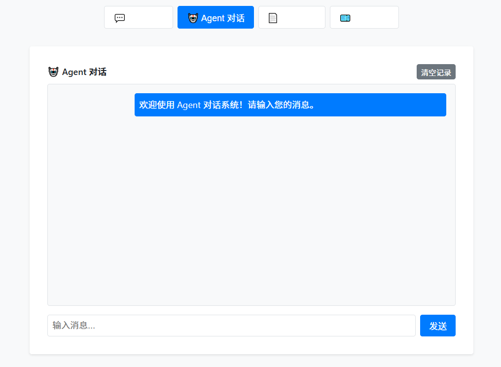
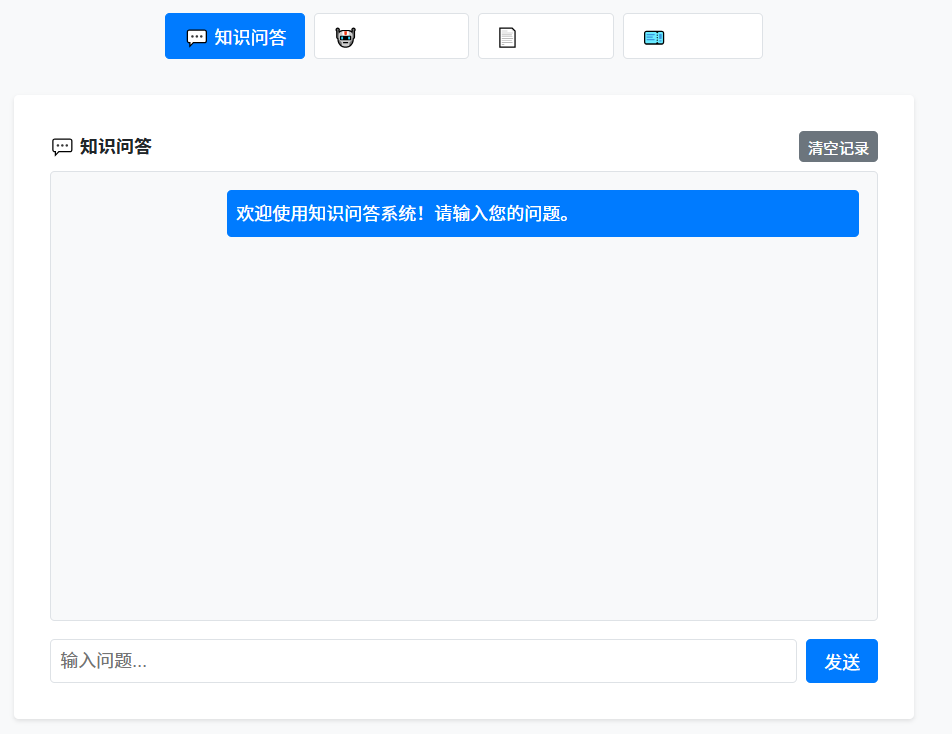
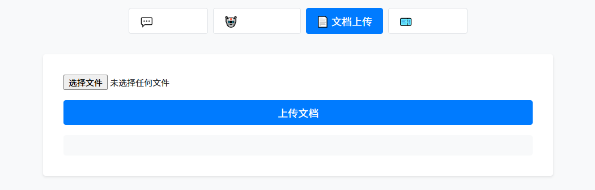
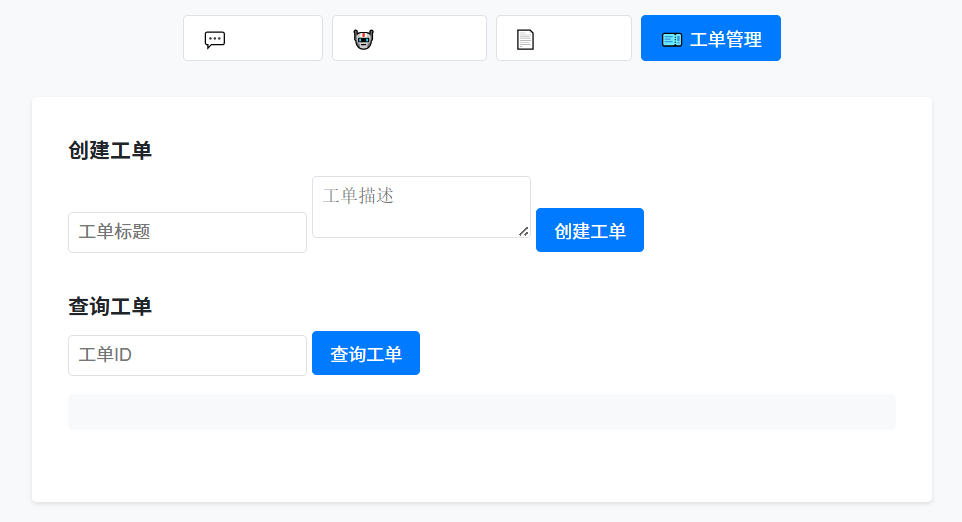
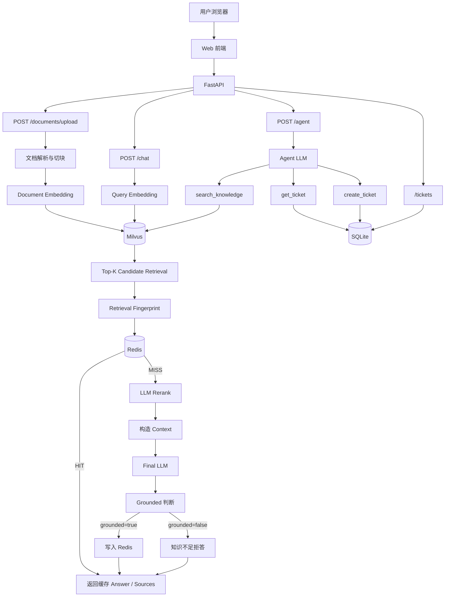

# EnterpriseOps Copilot

EnterpriseOps Copilot 是一个面向企业内部知识问答与 IT 工单场景的 LLM 应用项目。

项目基于 **RAG、向量检索、LLM Rerank、Agent Tool Calling** 构建企业知识问答与工单智能体，并结合 **Milvus、Redis、SQLite、FastAPI** 完成知识存储、缓存、业务数据管理与 API 服务。

项目同时提供基于原生 **HTML / CSS / JavaScript** 的 Web 前端，可直接完成知识问答、Agent 对话、文档上传和工单管理。

项目针对 RAG 实际使用中的缓存一致性问题进行了优化：通过 **Retrieval Fingerprint** 将 Redis 缓存与当前检索结果绑定，当知识库相关内容发生变化时自动绕过旧缓存，并结合 `grounded` 判断实现知识不足时的明确拒答。

---
## Demo






## 系统架构



---

## 核心功能

- 企业知识文档上传与解析，支持 PDF / TXT
- RecursiveCharacterTextSplitter 文本切块
- Embedding 向量化与 Milvus 向量存储
- COSINE 相似度 Top-K 候选召回
- LLM Rerank 二阶段重排序
- 基于检索上下文的 RAG 问答
- `grounded` 知识充分性判断与无依据拒答
- Retrieval Fingerprint 驱动的 Redis 缓存一致性机制
- Redis TTL 问答缓存
- RAG 回答知识来源展示
- SQLite + SQLAlchemy 工单持久化
- Agent Tool Calling
  - `search_knowledge`
  - `get_ticket`
  - `create_ticket`
- RAG 与 Agent 独立前端对话区域
- PDF / TXT 文档上传 Web 界面
- 工单创建与查询 Web 界面
- Hit@K / MRR 离线检索评测

---

## 技术栈

| 类别 | 技术 |
| --- | --- |
| Backend | Python / FastAPI / Pydantic |
| LLM Application | LangChain / RAG / Agent / Tool Calling |
| Vector Database | Milvus |
| Cache | Redis |
| Database | SQLite / SQLAlchemy |
| Frontend | HTML / CSS / JavaScript |
| Deployment & Environment | Docker / Docker Compose / Conda |
| Evaluation | Hit@K / MRR |

---

## Web Demo

启动 FastAPI 后访问：

```text
http://127.0.0.1:8000/
```

Web 前端目前提供四个主要功能区域：

```text
知识问答
Agent 对话
文档上传
工单管理
```

知识问答与 Agent 对话使用独立的前端消息区域，历史显示互不混淆。

FastAPI Swagger：

```text
http://127.0.0.1:8000/docs
```

---

# RAG Pipeline

## 1. 文档入库

```text
PDF / TXT
    ↓
Document Loader
    ↓
RecursiveCharacterTextSplitter
    ↓
Chunks
    ↓
Embedding
    ↓
Milvus
```

每个知识 Chunk 在 Milvus 中保存：

```text
id
vector
text
source
document_id
chunk_id
```

其中：

- `document_id` 标识一次文档入库
- `chunk_id` 标识该文档中的 Chunk 序号
- `(document_id, chunk_id)` 可以稳定标识一个知识片段

---

## 2. RAG 问答流程

```text
Question
    ↓
Query Embedding
    ↓
Milvus Candidate Retrieval
    ↓
Top-K Candidate Hits
    ↓
Retrieval Fingerprint
    ↓
Redis Cache Lookup
    │
    ├── HIT
    │    ↓
    │  直接返回缓存 Answer / Sources
    │
    └── MISS
         ↓
       LLM Rerank
         ↓
       Top-N Knowledge Chunks
         ↓
       Context
         ↓
       Final LLM
         ↓
       answer + grounded
```

当：

```text
grounded = true
```

说明当前检索上下文能够为回答提供足够依据，结果写入 Redis。

当：

```text
grounded = false
```

后端统一返回：

```text
根据当前知识库无法确定。
```

该拒答结果不会写入长期缓存。

---

# Retrieval Fingerprint Cache

传统缓存如果仅使用：

```text
question_hash → answer
```

当知识库发生更新后，即使最新知识已经变化，相同问题仍可能直接命中旧答案。

本项目将缓存检查移动到候选检索之后。

流程：

```text
Question
    ↓
Embedding
    ↓
Milvus Candidate Retrieval
    ↓
(document_id, chunk_id)
    ↓
Stable Sort
    ↓
SHA-256
    ↓
Retrieval Fingerprint
```

缓存 Key 类似：

```text
rag:v1:{question_hash}:{retrieval_fingerprint}:{top_k}
```

因此：

```text
问题相同 + 当前候选知识没有变化
→ Fingerprint 不变
→ Redis HIT
→ 跳过 LLM Rerank 和 Final LLM
```

而当上传新的相关知识后：

```text
Milvus Candidate Set 发生变化
→ Fingerprint 变化
→ Redis MISS
→ 重新执行 Rerank + Final LLM
→ 生成基于最新知识的回答
```

这样可以避免简单的：

```text
上传文档 → 清空全部 RAG Cache
```

同时降低知识库更新后继续返回陈旧答案的风险。

该设计的取舍是：

```text
Query Embedding + Milvus Candidate Retrieval
```

每次请求都需要执行，而缓存主要用于省去成本更高的：

```text
LLM Rerank
+
Final LLM
```

---

# Agent

Agent 使用 LangChain Agent + Tool Calling。

流程：

```text
User Request
    ↓
Agent LLM
    ↓
判断是否需要调用 Tool
    ↓
Tool Execution
    ↓
Tool Result
    ↓
Agent Final Answer
```

目前提供三个 Tool。

### search_knowledge

用于查询企业知识库：

```text
Agent
↓
search_knowledge
↓
RAG Retrieval + Rerank
↓
Knowledge Hits
```

### get_ticket

根据工单号查询 SQLite：

```text
Agent
↓
get_ticket
↓
SQLite
```

### create_ticket

用户明确提出创建工单时：

```text
Agent
↓
create_ticket
↓
SQLite
```

当前 Agent 为单次请求模式，暂未引入跨请求 Conversation Memory。

---

# RAG 检索评测

项目构造企业知识干扰数据与 12 条较高难度测试问题，对向量召回与 LLM Rerank 后的排序效果进行离线评测。

| 方法 | Hit@1 | Hit@3 | Hit@5 | MRR |
| --- | ---: | ---: | ---: | ---: |
| Milvus Vector Search | 0.7500 | 1.0000 | 1.0000 | 0.8750 |
| Vector Search + LLM Rerank | 1.0000 | 1.0000 | 1.0000 | 1.0000 |

在当前测试集上：

```text
Hit@1
0.75 → 1.00

MRR
0.875 → 1.00
```

说明 LLM Rerank 能够有效改善当前测试集中的候选知识排序。

> 以上结果仅代表当前项目测试集上的检索表现，不代表生产环境中的泛化性能。

---

# 项目结构

```text
app/
├── routers/
│   ├── agent.py
│   ├── chat.py
│   ├── documents.py
│   └── tickets.py
│
├── services/
│   ├── agent_service.py
│   ├── agent_tools.py
│   ├── cache.py
│   ├── document_service.py
│   ├── embedding.py
│   ├── llm.py
│   ├── milvus_store.py
│   ├── rag.py
│   ├── reranker.py
│   └── ticket_service.py
│
├── static/
│   ├── index.html
│   ├── style.css
│   └── app.js
│
├── config.py
├── db.py
├── main.py
├── models.py
└── schemas.py

eval/
└── evaluate.py

docker-compose.yml
requirements.txt
.env.example
README.md
```

---

# API

启动服务后可以通过 Swagger 查看完整 API：

```text
http://127.0.0.1:8000/docs
```

主要接口：

| Method | Path | Description |
| --- | --- | --- |
| GET | `/health` | 服务健康检查 |
| POST | `/documents/upload` | PDF / TXT 文档上传与知识入库 |
| POST | `/chat` | RAG 企业知识问答 |
| POST | `/agent` | Agent 智能助手 |
| POST | `/tickets` | 创建工单 |
| GET | `/tickets/{ticket_id}` | 查询工单 |

---

## RAG 请求示例

```json
{
  "question": "磁盘使用率达到多少会触发高优先级告警？",
  "top_k": 5
}
```

返回结果包含：

```json
{
  "answer": "......",
  "sources": [],
  "grounded": true,
  "cached": false
}
```

其中：

```text
grounded
```

表示当前回答是否具有足够的知识库上下文依据。

```text
cached
```

表示本次最终答案是否命中了 Redis 缓存。

---

## Agent 请求示例

查询工单：

```json
{
  "message": "帮我查询工单 T20260821205120243923"
}
```

Agent 会根据用户意图自动选择：

```text
get_ticket
```

知识查询：

```json
{
  "message": "VPN 连不上应该先检查什么？"
}
```

Agent 可以自动选择：

```text
search_knowledge
```

创建工单：

```json
{
  "message": "帮我创建一个打印机无法使用的工单"
}
```

Agent 可以自动选择：

```text
create_ticket
```

---

# 本地运行

## 1. 创建并激活 Python 环境

```powershell
conda create -n enterpriseops python=3.12
conda activate enterpriseops
```

## 2. 进入项目目录

```powershell
cd <your-project-directory>
```

## 3. 安装依赖

```powershell
pip install -r requirements.txt
```

## 4. 配置环境变量

根据：

```text
.env.example
```

创建：

```text
.env
```

并填写模型 API、Embedding、Milvus、Redis 等配置。

> `.env` 可能包含 API Key，请勿提交到 Git 仓库。

---

## 5. 启动 Redis

当前仓库中的：

```text
docker-compose.yml
```

用于启动 Redis。

```powershell
docker compose up -d
```

查看：

```powershell
docker ps
```

测试 Redis：

```powershell
docker exec enterpriseops-redis redis-cli ping
```

正常返回：

```text
PONG
```

---

## 6. 启动 Milvus

项目使用 Milvus Standalone 作为向量数据库。

确认 Milvus 容器：

```powershell
docker ps --filter "name=milvus-standalone"
```

项目默认通过类似以下地址连接：

```dotenv
MILVUS_URI=http://localhost:19530
```

当前仓库中的 Docker Compose 主要负责 Redis，Milvus Standalone 独立运行。

---

## 7. 启动 FastAPI

```powershell
python -m uvicorn app.main:app --reload
```

访问 Web Demo：

```text
http://127.0.0.1:8000/
```

访问 Swagger：

```text
http://127.0.0.1:8000/docs
```

---

# 离线评测

在项目根目录执行：

```powershell
python -m eval.evaluate
```

程序会输出每个测试问题对应知识的排名以及：

```text
Hit@1
Hit@3
Hit@5
MRR
```

用于衡量知识检索与 LLM Rerank 的排序效果。

---

# Engineering Highlights

### 1. 二阶段 RAG 检索

使用：

```text
Milvus Vector Retrieval
+
LLM Rerank
```

兼顾候选召回效率和最终知识排序质量。

### 2. Retrieval-Aware Cache

Redis Cache 不再仅与 Question 绑定，而是同时绑定当前 Retrieval Fingerprint。

解决知识库增量更新后旧 RAG Answer 仍被缓存命中的问题。

### 3. Grounded Refusal

最终 LLM 同时生成：

```text
answer
+
grounded
```

知识依据不足时后端统一拒答，避免模型脱离知识库自由生成。

### 4. Agent Tool Calling

Agent 可以根据用户意图自主选择知识检索、工单查询和工单创建 Tool。

### 5. 完整 Web Demo

FastAPI 同时提供 API 与静态 Web 页面，前后端同源通信，无需额外部署独立前端服务。

---

# 后续规划

- 增加无关问题 / 拒答能力评测
- PDF Page-level 来源定位
- Agent Session Memory / Conversation State
- MCP Tool / Resource 接入
- Agent 调用链 Tracing 与可观测性
- 更大规模知识库与评测集
- Cross-Encoder Reranker 对比实验
- 完整 Docker Compose 一键部署